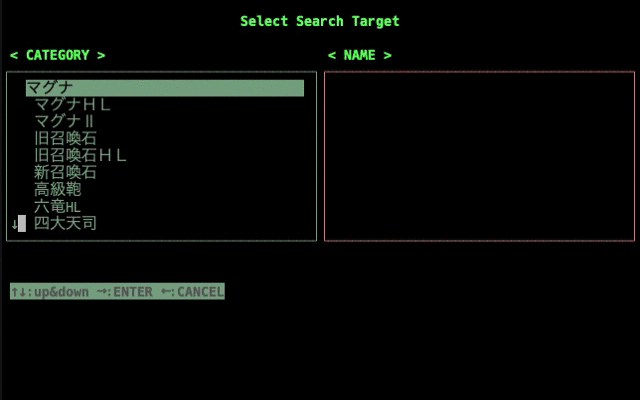

# GBF Search Tool

## これはなに? / What is this?
ブラウザゲーム「グランブルーファンタジー」のTwitter救援検索支援ツールです。
ボス選択画面で選んだマルチバトルの救援ツイートを検索して、もっとも新しいtweetの救援IDをクリップボードにコピーします。

## 動作に必要な環境 / Requirements
* Windows 10 or macOS

    Windows10とmacOS 10.14.6にて動作検証しています。環境を整えればソース自体を直接実行することでLinuxでも実行できると思われます。
* Twitter Develop Account & APIKey

    TwitterのAPIを利用するためのAPI keyが必要です。これらを得るためにはTwitterの開発者アカウントの登録とアプリケーションの登録が必要です。

## 実行方法 / How to Run

1. Releaseから環境にあったzipファイルをダウンロードし解凍する
1. `config.toml`を編集し、API keyをセットする
1. `run.exe`をダブルクリックする or Terminal.appなどで解凍したディレクトリを開き`run`を実行する

## 開発環境の構築 / Build a Dev Environment

1. Python 3.8.x が動作する環境を作る
1. リポジトリをクローンする
1. `pip install -r requirement.txt`
1. (Windowsのみ) `pip install windows-curses`
1. `python run.py`でアプリケーションが動作すればOK

"Copyright © 2000 yume_yu me@yume-yu.com & kumamono This work is free. You can redistribute it and/or modify it under the terms of the Do What The Fuck You Want To Public License, Version 2, as published by Sam Hocevar. See the COPYING file for more details."
